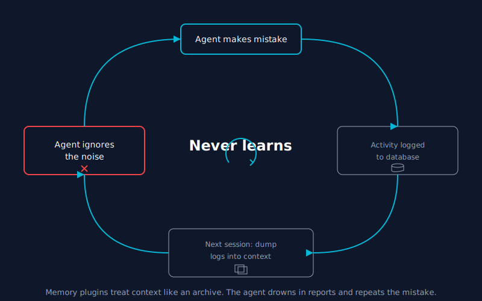
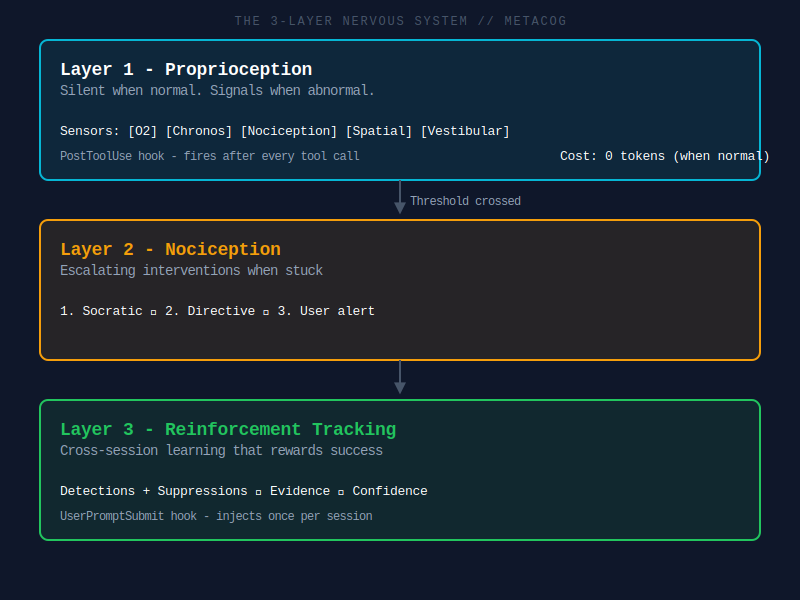
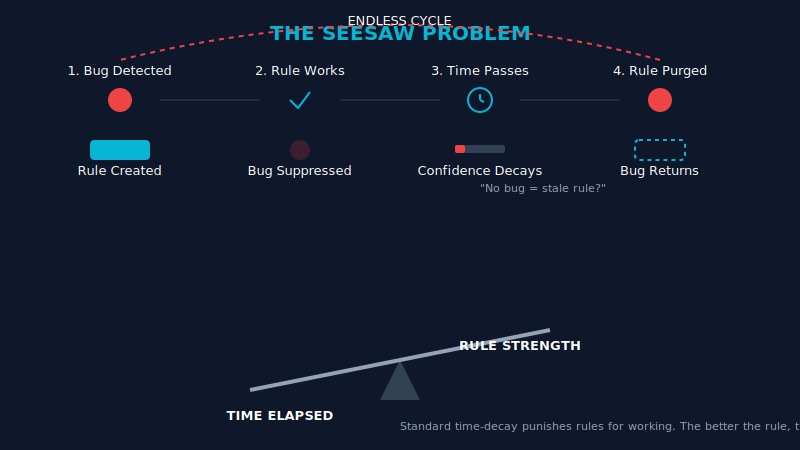
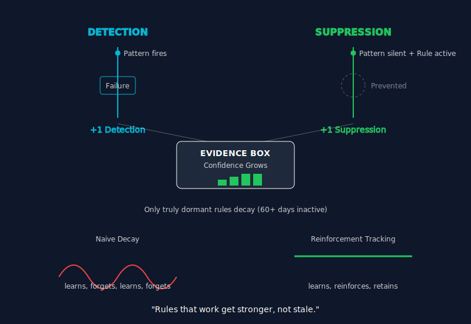

# @houtini/metacog

**AI coding agents are brains in vats.** They can reason about almost anything, but they can't feel their context window filling up, don't know how long they've been working, can't sense when they're going in circles, and have no peripheral vision of how their changes affect the wider codebase.

Metacog gives them a nervous system. Five proprioceptive senses. Cross-session reinforcement tracking. Two hooks. Zero dependencies.

---

## Why not memory?

So, the trend right now is memory. Everyone's building memory plugins for AI agents - activity logs, episodic memory in SQLite, vector databases, semantic search over past sessions. And my first instinct was the same. I figured I'd pipe all the session data into a database, summarise it, feed it back in next time, and the agent would just... remember.

But here's the thing. If memory was the real problem, the AI companies would have solved it already. Anthropic, OpenAI, Google - they're not short on engineers. Models already learn from our inputs, collectively, across millions of conversations. But we have to wait for the next model release to benefit from that. And even then, it's generic. It's everyone's patterns averaged together, not yours.

The problem with memory plugins is more fundamental than stale data or token costs (though those are real problems too). It's that they treat the agent's context window like a filing cabinet. When a new session starts, they dump a stack of past observations into the prompt and hope the agent pays attention. It's like trying to teach someone to ride a bike by making them read a physics textbook while they're pedalling. The agent drowns in the report and walks right into the same trap.

<div align="center">
  
</div>

What I actually needed wasn't better memory. It was something closer to a nervous system - real-time, low-level awareness of operational state. Not "here's what you did wrong last Tuesday" but "you're going in circles right now."

And then, for the cross-session piece, not a memory dump but something that tunes your Claude experience based on the unique challenges you've actually faced. Not generic best practices from a training corpus. Your patterns. Your failure modes. Your projects.

That's what Metacog does.

---

## What it actually does

Metacog runs as a pair of Claude Code hooks. One fires after every tool call (the nervous system), the other fires once per session (the reinforcement injector). When everything is normal, both produce zero output and cost zero tokens. When something is abnormal, a short proprioceptive signal gets injected into the agent's context. Not a command. Just awareness. The agent's own reasoning decides what to do about it.

### The five senses

| Sense | Signal | What it detects |
|-------|--------|-----------------|
| **O2** | Context trend | Token velocity spikes - the agent is consuming context unsustainably |
| **Chronos** | Temporal awareness | Time and step count since last user interaction - the agent has no internal clock |
| **Nociception** | Error friction | Repeated similar errors - the agent is stuck but hasn't recognised it |
| **Spatial** | Blast radius | File dependency count after writes - the agent is modifying a module imported by 14 other files |
| **Vestibular** | Action diversity | Repeated identical actions - the agent is going in circles without triggering errors |

### The three-layer nervous system

<div align="center">
  
</div>

**Layer 1: Proprioception** (always on, near-zero cost)
Calculates all five senses after every tool call. Injects a signal only when values deviate from baseline. Most turns: completely silent.

```
[Proprioception]
Context filling rapidly - 3 large file reads in last 5 actions.
Consider summarising findings before proceeding.
```

**Layer 2: Nociception** (triggered by Layer 1 thresholds)
When error friction crosses critical thresholds, it forces a cognitive shift. Escalating interventions - socratic questioning first, then directive instructions, then flagging the user.

```
[NOCICEPTIVE INTERRUPT]
You have attempted 4 similar fixes with consecutive similar errors.
Before taking another action:
1. State the assumption you are currently operating on
2. Describe what read-only action would falsify that assumption
3. Execute that investigation before writing any more code
```

**Layer 3: Reinforcement tracking** (cross-session learning)
This is the interesting bit, and it's where Metacog diverges from every memory plugin I've seen.

---

## The seesaw problem

I ran into this really frustrating problem when I tried to implement cross-session learning with standard time-decay.

There's an Experiential RL paper (arxiv 2602.13949) that shows how reflecting on failures at training time improves agent performance by up to 81%. So I built a system that detected failure patterns, recorded rules to prevent them, and injected those rules into the next session. And it worked. For a while.

But then the rules started disappearing.

<div align="center">
  
</div>

The problem is that naive time-decay actively punishes success. If the agent learns "don't retry the same error three times" and then it stops retrying the same error, the decay system sees the rule going stale - no recent detections, must be irrelevant - and prunes it. So the agent forgets the rule. And then the behaviour regresses, the rule fires again, confidence climbs, the behaviour improves, the rule decays again. Seesaw.

The better the rule works, the faster the system kills it. That's not learning. That's an oscillation.

## Reinforcement tracking

To fix the seesaw, I had to invert the decay model entirely.

<div align="center">
  
</div>

When the nervous system detects a failure pattern, it records a **detection** - the problem happened. But when a known pattern *doesn't* fire during a session where its rule was active, that's not nothing. That's evidence the rule is working. The system records a **suppression** alongside the original detection. Both count as evidence. Both increase confidence.

Rules that successfully suppress their target failure get reinforced by their own success. Only truly dormant rules - patterns that haven't been active at all for 60+ days - decay. And even then, slowly.

This is what makes Metacog different from a memory plugin. It's not replaying what happened. It's tracking what works, what doesn't work, and getting more confident over time about rules that actually prevent failures. It tunes your Claude experience based on the unique challenges you've faced - not generic training data, not someone else's patterns. Yours.

### How the data flows

**Session start** - the `UserPromptSubmit` hook fires. It compiles all learnings (global + project-scoped) into a digest, injects it as a system-reminder, and writes a marker file listing which pattern IDs were injected. This marker is how the system knows which rules were "active" during the session.

**During the session** - the `PostToolUse` hook fires after every tool call. It records actions into a rolling 20-item window. Silent when normal. Signals when abnormal. No learning happens here - this is pure proprioception.

**Session end** - when the next session starts, the first tool call triggers a session ID change. Before resetting state, the system:
1. Reads the active patterns marker from the previous session
2. Runs all pattern detectors against the session state
3. For each detector that fires: emits a **detection** (the failure happened)
4. For each detector that *doesn't* fire but was in the active set: emits a **suppression** (the rule prevented the failure)
5. Persists both to the JSONL log - global and project-scoped

**Compilation** - next session's digest merges detections and suppressions. Both increase total evidence. Suppressions get a confidence bonus. Only rules with zero activity for 60+ days decay. Pruning at 120 days for low-evidence rules.

### Per-project scoping

Learnings are stored at two levels:

- **Global** (`~/.claude/metacog-learnings.jsonl`) - patterns that apply everywhere
- **Project** (`<project>/.claude/metacog-learnings.jsonl`) - patterns specific to this codebase

At compilation time, both are merged. Project-scoped entries take precedence where they overlap. So a pattern that only happens in one repo builds evidence specifically for that repo, without polluting the global set.

---

## Get started in one minute

**Step 1: Install the hooks**

```bash
npx @houtini/metacog --install
```

This adds both hooks to your global Claude Code settings (`~/.claude/settings.json`):
- `PostToolUse` - the nervous system (fires after every tool call)
- `UserPromptSubmit` - the digest injector (fires once per session, injects learned rules)

For per-project installation:

```bash
npx @houtini/metacog --install --project
```

**Step 2: Use Claude Code normally**

That's it. Metacog runs silently. You'll only see output when something is abnormal.

### Manual installation

If you prefer to configure the hooks yourself:

```json
{
  "hooks": {
    "PostToolUse": [
      {
        "matcher": "*",
        "hooks": [
          {
            "type": "command",
            "command": "node /path/to/metacog/src/hook.js"
          }
        ]
      }
    ],
    "UserPromptSubmit": [
      {
        "hooks": [
          {
            "type": "command",
            "command": "node /path/to/metacog/src/digest-inject.js"
          }
        ]
      }
    ]
  }
}
```

### Local build

```bash
git clone https://github.com/houtini-ai/metacog
cd metacog
npm test
```

Zero dependencies. Nothing to build. The source is the distribution.

---

## Configuration

Metacog works with zero configuration. To tune thresholds, create `.claude/metacog.config.json` in your project:

```json
{
  "proprioception": {
    "o2": {
      "velocity_multiplier": 3,
      "baseline_window": 10
    },
    "chronos": {
      "time_threshold_minutes": 15,
      "step_threshold": 25
    },
    "nociception": {
      "consecutive_errors": 3,
      "error_similarity": 0.6,
      "window_size": 5
    },
    "spatial": {
      "blast_radius_threshold": 5,
      "enabled": true
    },
    "vestibular": {
      "action_similarity": 0.8,
      "consecutive_similar": 4
    }
  },
  "nociception": {
    "escalation_cooldown": 5,
    "reflex_arc_threshold": 8
  }
}
```

| Setting | Default | What it does |
|---------|---------|-------------|
| `o2.velocity_multiplier` | 3 | Trigger when token velocity exceeds baseline by this factor |
| `chronos.time_threshold_minutes` | 15 | Signal after this many minutes without user interaction |
| `chronos.step_threshold` | 25 | Signal after this many tool calls without user interaction |
| `nociception.consecutive_errors` | 3 | Similar errors before signalling |
| `spatial.blast_radius_threshold` | 5 | File imports before signalling |
| `vestibular.consecutive_similar` | 4 | Identical actions before signalling |

---

## The backstory

This started with a question about metacognition - thinking about thinking. Could we make AI agents reflect on their own behaviour? But the deeper I got, the more I realised the real problem isn't that agents think badly. It's that they can't feel anything.

I don't know much about human neurology, but the proprioception metaphor turned out to be the right one. You don't avoid walking into walls because a "Collision Detection Module" writes a report about a recent impact. You avoid walls because your nervous system provides immediate, low-latency, non-verbal feedback about your physical state and boundaries. That's the insight from the Extended Mind Thesis (Clark & Chalmers) - cognition doesn't just happen in the brain, it happens in the interaction between the system and its environment.

But proprioception alone only works within a session. The agent wakes up fresh every time. So I built reinforcement tracking on top - a way for the agent to carry forward behavioural lessons across sessions, with a confidence model that actually rewards rules for working rather than punishing them for not failing.

Most agent memory systems are either activity logs (what happened) or skill libraries (what to do). This is neither. It's a record of what goes wrong, what prevents it from going wrong, and how confident we should be in each lesson. It adapts to you.

See `SPEC.md` for the full design specification and theoretical foundation.

---

## Design principles

- **No news is good news** - signals only appear when values deviate from baseline. The absence of a signal means everything is fine
- **Trends over absolutes** - measures velocity and trajectory, not absolute values. We can't know the exact context limit, so we track "filling rapidly" not "88% full"
- **Inform, don't command** - provides awareness, trusts the agent's reasoning. Only at extreme thresholds does the system force a cognitive shift
- **Graceful degradation** - if the hooks fail, the agent is just normal Claude. Nothing breaks
- **Reinforcement over decay** - rules that work get stronger, not stale

## Requirements

- Node.js 18+
- Claude Code with hooks support

## Licence

Apache-2.0
