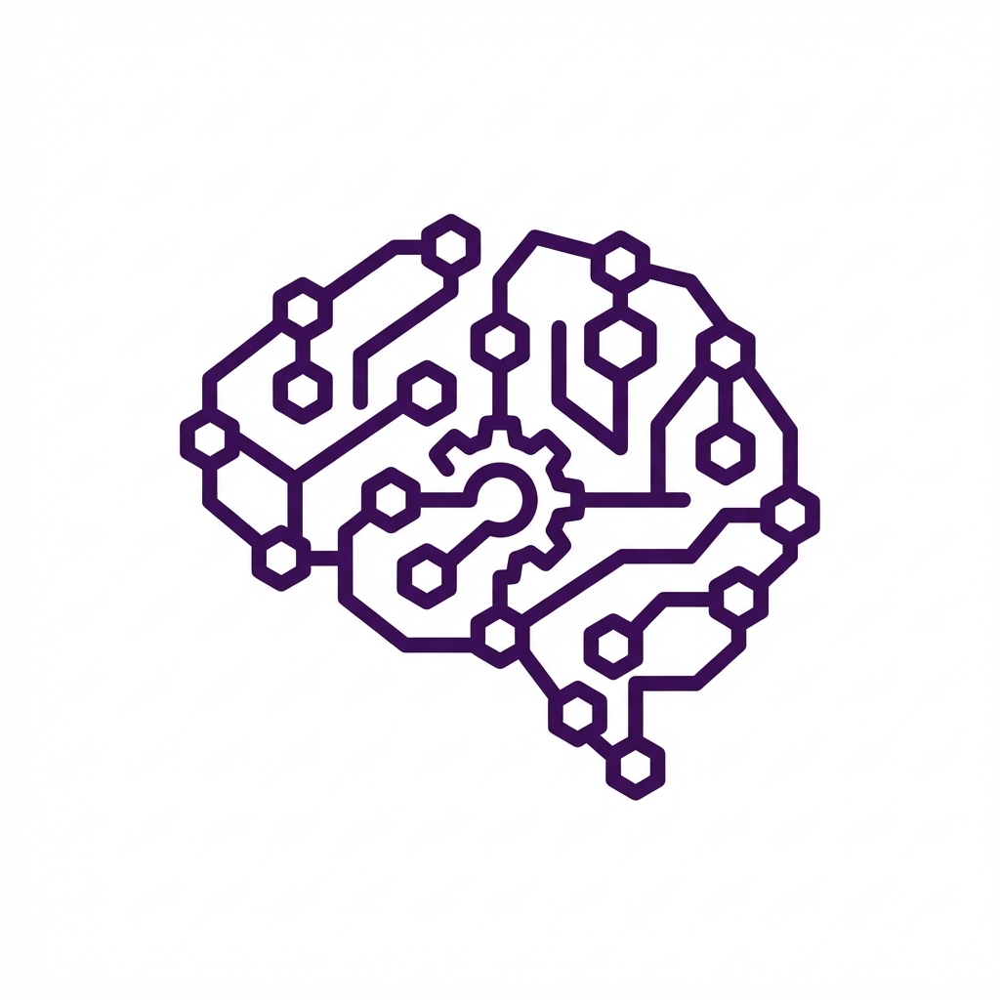
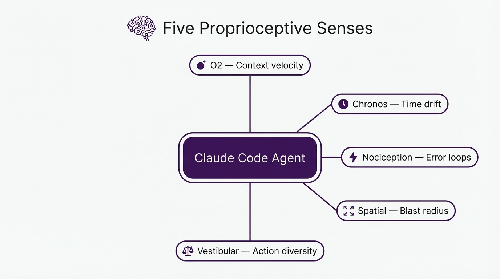
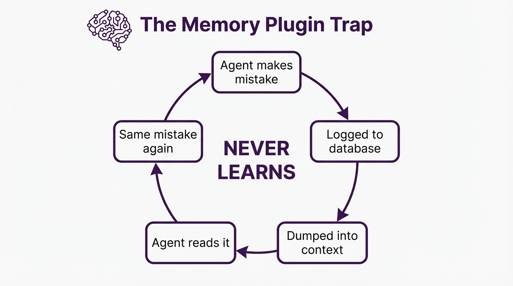
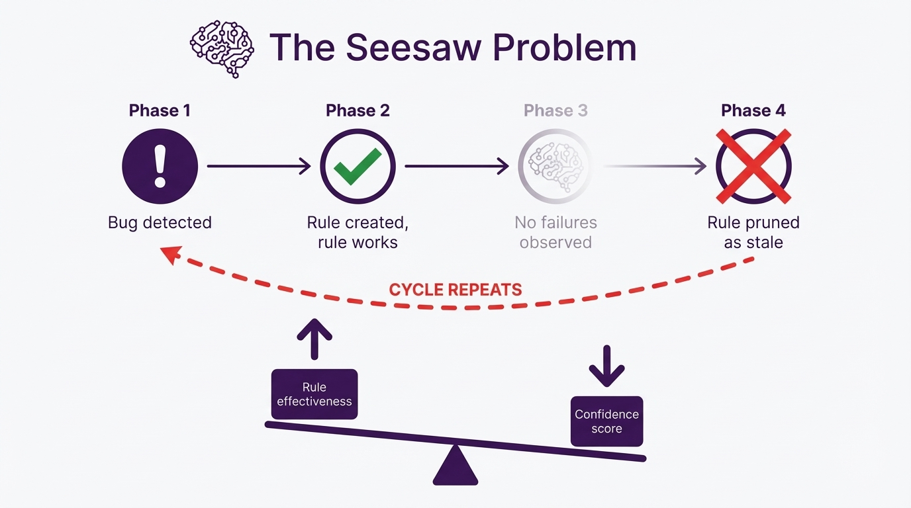
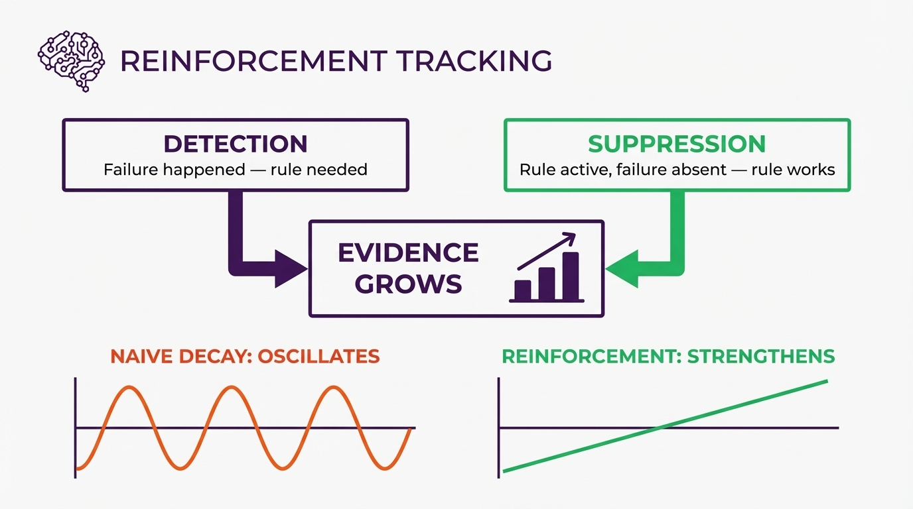

# metacog

[](https://www.npmjs.com/package/@houtini/metacog)
[](https://snyk.io/test/github/houtini-ai/metacog)

<p align="center">
  
</p>

Metacog takes a different approach to a memory mcp - instead of replaying the past, it gives your Claude Code agent real-time awareness of its own state. Five senses detect context overflow, stuck loops, repeated errors, and circular actions before they spiral. And when problems resolve, the system learns what fixed them - building rules that get stronger over time, not stale. Zero dependencies. One-command install. Open source.

---

## Install

```bash
npx @houtini/metacog --install
```

That's it. The installer registers both hooks into your Claude Code settings. Metacog runs silently in the background from that point on - you'll only see output when something is abnormal.

### Project-scoped install

```bash
npx @houtini/metacog --install --project
```

Installs into `.claude/settings.json` in the current project instead of globally.

### Development install

```bash
git clone https://github.com/houtini-ai/metacog
cd metacog && npx @houtini/metacog --install
```

---

## What are Claude Code hooks?

Hooks are shell commands that Claude Code runs automatically at specific moments during a session. They're the plugin system's way of letting tools react to what the agent is doing, without the agent having to ask for it.

There are a few hook events that matter here:

| Hook event | When it fires | What it's for |
|------------|--------------|---------------|
| `PostToolUse` | After the agent uses any tool (Read, Write, Bash, etc.) | Monitoring, validation, side effects |
| `UserPromptSubmit` | When you send a message | Injecting context, session setup |
| `PreToolUse` | Before a tool runs | Blocking dangerous actions |
| `Stop` | When the agent finishes responding | Cleanup, verification |

Hooks communicate back to Claude via JSON on stdout:

```json
{
  "continue": true,
  "suppressOutput": false,
  "systemMessage": "This message appears in the agent's context"
}
```

If a hook outputs nothing and exits 0, it's invisible. Zero token cost. Zero latency (well, near-zero). This is what makes hooks different from MCP servers - they can be completely silent when there's nothing to say.

Metacog uses two hooks: `PostToolUse` for the nervous system and `UserPromptSubmit` for injecting learned rules at session start.

---

## What it does

Metacog runs as a pair of Claude Code hooks. One fires after every tool call (the nervous system), the other fires once per session (the reinforcement injector). When everything is normal, both produce zero output and cost zero tokens. When something is abnormal, a short signal appears in the agent's context. Not a command - just awareness. The agent's own reasoning decides what to do about it.

### The five senses

| Sense | Signal | What it detects |
|-------|--------|-----------------|
| **O2** | Context trend | Token velocity spikes - the agent is consuming context unsustainably |
| **Chronos** | Temporal awareness | Time and step count since last user interaction |
| **Nociception** | Error friction | Repeated similar errors - the agent is stuck |
| **Spatial** | Blast radius | File dependency count after writes |
| **Vestibular** | Action diversity | Repeated identical actions - going in circles |

### The three layers

<div align="center">
  
</div>

**Layer 1: Proprioception** (always on, near-zero cost)
Calculates all five senses after every tool call. Injects a signal only when values deviate from baseline. Most turns: completely silent.

```
[Proprioception]
Context filling rapidly - 3 large file reads in last 5 actions.
Consider summarising findings before proceeding.
```

**Layer 2: Nociception** (triggered by Layer 1 thresholds)
When error friction crosses critical thresholds, escalating interventions kick in - Socratic questioning first, then directive instructions, then flagging the user.

```
[NOCICEPTIVE INTERRUPT]
You have attempted 4 similar fixes with consecutive similar errors.
Before taking another action:
1. State the assumption you are currently operating on
2. Describe what read-only action would falsify that assumption
3. Execute that investigation before writing any more code
```

**Layer 3: Motor Learning** (cross-session)
When a nociceptive event resolves, the system extracts what changed. The delta between failure and resolution gets persisted as a behavioural lesson and injected into future sessions.

---

## Why not memory?

Everyone's building memory plugins - activity logs, vector databases, episodic recall. They all do roughly the same thing: capture what the agent did, compress it, store it, dump it back into context next session.

The problem is fundamental. They treat the agent's context like a filing cabinet. The agent drowns in the report and walks into the same trap anyway.

<div align="center">
  
</div>

Metacog doesn't replay what happened. It tracks what works, what doesn't, and gets more confident over time about rules that actually prevent failures.

### The seesaw problem

Standard time-decay actively punishes success. If the agent learns "don't retry the same error three times" and stops doing it, the decay system sees the rule going stale and prunes it. The agent forgets. The behaviour regresses.

<div align="center">
  
</div>

Metacog inverts this. When a known pattern *doesn't* fire during a session where its rule was active, that's a **suppression** - evidence the rule is working. Both detections and suppressions increase confidence. Only truly dormant rules decay.

<div align="center">
  
</div>

---

## How the data flows

**Session start** - the `UserPromptSubmit` hook compiles all learnings (global + project-scoped) into a digest and injects it as a system message. A marker file records which patterns were active.

**During the session** - the `PostToolUse` hook fires after every tool call. It records actions into a rolling 20-item window. Silent when normal. Signals when abnormal.

**Session end** - when the next session starts, the system:
1. Reads the active patterns from the previous session
2. Runs all pattern detectors against the session state
3. Detections: the failure happened
4. Suppressions: the rule was active, its preconditions were met, but the failure didn't happen (evidence the rule worked)
5. Persists both to JSONL - global and project-scoped

### Per-project scoping

Learnings are stored at two levels:

- **Global** (`~/.claude/metacog-learnings.jsonl`) - patterns that apply everywhere
- **Project** (`<project>/.claude/metacog-learnings.jsonl`) - patterns specific to this codebase

Project-scoped entries take precedence where they overlap.

---

## Configuration

Metacog works with zero configuration. To tune thresholds, create `.claude/metacog.config.json` in your project:

```json
{
  "proprioception": {
    "o2": {
      "velocity_multiplier": 3,
      "baseline_window": 10
    },
    "chronos": {
      "time_threshold_minutes": 15,
      "step_threshold": 25
    },
    "nociception": {
      "consecutive_errors": 3,
      "error_similarity": 0.6,
      "window_size": 5
    },
    "spatial": {
      "blast_radius_threshold": 5,
      "enabled": true
    },
    "vestibular": {
      "action_similarity": 0.8,
      "consecutive_similar": 4
    }
  },
  "nociception": {
    "escalation_cooldown": 5,
    "reflex_arc_threshold": 8
  }
}
```

| Setting | Default | What it does |
|---------|---------|-------------|
| `o2.velocity_multiplier` | 3 | Trigger when token velocity exceeds baseline by this factor |
| `chronos.time_threshold_minutes` | 15 | Signal after this many minutes without user interaction |
| `chronos.step_threshold` | 25 | Signal after this many tool calls without user interaction |
| `nociception.consecutive_errors` | 3 | Similar errors before signalling |
| `spatial.blast_radius_threshold` | 5 | File imports before signalling |
| `vestibular.consecutive_similar` | 4 | Identical actions before signalling |

### Pattern detectors

The cross-session learning detectors are configurable. Tune thresholds or disable individual detectors:

```json
{
  "patterns": {
    "circular_search": { "enabled": true, "consecutive_runs": 2 },
    "repeated_file_read": { "enabled": true, "repeat_threshold": 3 },
    "error_loop": { "enabled": true, "recent_window": 10, "min_errors": 4, "max_unique_sigs": 2 },
    "long_autonomous_run": { "enabled": true, "turn_threshold": 50 },
    "write_heavy_session": { "enabled": true, "min_writes": 10, "read_ratio": 0.5 }
  }
}
```

### Custom pattern detectors

Define your own detectors in JSON:

```json
{
  "custom_patterns_path": ".claude/my-patterns.json"
}
```

```json
[
  {
    "id": "too_many_bash_calls",
    "category": "Execution Patterns",
    "lesson": "Consider using dedicated tools (Read, Grep) instead of Bash for file operations.",
    "relevant_tools": ["Bash"],
    "condition": {
      "type": "count_exceeds",
      "filter": { "tool_name": "Bash" },
      "threshold": 15
    }
  }
]
```

Supported condition types: `count_exceeds`, `consecutive_exceeds`, `ratio_exceeds`.

---

## Plugin structure

```
metacog/
├── .claude-plugin/
│   ├── plugin.json           # Plugin identity
│   └── marketplace.json      # Marketplace distribution
├── hooks/
│   └── hooks.json            # Hook event configuration
├── src/
│   ├── hook.js               # PostToolUse - nervous system
│   ├── digest-inject.js      # UserPromptSubmit - reinforcement injector
│   ├── lib/
│   │   ├── config.js         # Configuration + defaults
│   │   ├── learnings.js      # Cross-session pattern detection
│   │   └── state.js          # Rolling action window + token estimation
│   └── senses/
│       ├── o2.js             # Context trend
│       ├── chronos.js        # Temporal awareness
│       ├── nociception.js    # Error friction + escalation
│       ├── spatial.js        # Blast radius
│       └── vestibular.js     # Action diversity
├── assets/
│   └── icon.png              # Plugin icon
└── docs/                     # Diagrams
```

---

## Design principles

- **No news is good news** - signals only appear when values deviate from baseline
- **Trends over absolutes** - measures velocity, not absolute values
- **Inform, don't command** - provides awareness, trusts the agent's reasoning
- **Graceful degradation** - if the hooks fail, the agent is just normal Claude
- **Reinforcement over decay** - rules that work get stronger, not stale

## Requirements

- Node.js 18+
- Claude Code with plugin support

## Backstory

See `SPEC.md` for the full design specification and the research behind the reinforcement model.

## Licence

Apache-2.0
